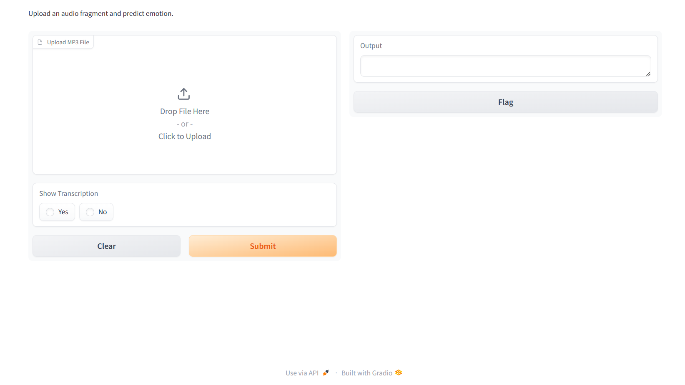

# Speech-to-Text Pipeline

## The Kaggle Competition
---

## Michal, Lea, Francisco, Stijn and Rens

---
**NOTE:**

  Unfortunately it wasn't possible to upload the full pipeline containing the model and audio fragments folders as they amount to a size over 25mb

## Pipeline links:

[Version_1](https://edubuas-my.sharepoint.com/:u:/g/personal/220387_buas_nl/EW-whwxHMdlFlpmX-OFBIy4Bn67zkULQtbgYqe2oD5Q97Q?e=kdOOMA)
### > [Final Pipeline](https://edubuas-my.sharepoint.com/:u:/g/personal/220387_buas_nl/ESjA5NiLqvdMotT430_0fvkBsJaNkj0VNHMoFB4QTWr7cg?e=CH4Ifm)

---
## Folder content explanation

### `fragments_per_episode` - audio fragments folder

This notebook contains all the audios of each of the episodes of Expedite Robinson 22, specifically:

1. It has a folder dedicated to each episode
2. Each episode was subdivided into several chunks (called "fragments") that were split according to the Expedite_Robinson_data.csv file that was given to us
3. All of the audios are in .mp3 format

### `client_data/Expiditie_Robinson_Data` - dataframe

This folder contains a csv **fragment_emotions.csv** that contains information about the human labels of each episode's fragment which the pipeline uses to assess the model prediction

### `models/Roberta_V3-final` - contains the files necessary to apply predictions to sentences

- label_encoder.joblib
- tokenizer folder
- model folder


---

## How to use the pipeline 

1. Install the required packages which can be found in requirements.txt
2. Open the `Speech-to-text pipeline.ipynb`
3. Run the code cell and you will find an easy to use interface:

--

--


The pipeline expects the audio files to be in a certain format. That format is mentioned in the markdown cell before the code cell and you can already find the audios in the correct format in the `fragments_per_episode` folder

## How does the pipeline work?

### `backend.py`

First of all the script loads the necessary dataframe and model files:


   ```python
# Loading the dataframe with the data about fragment and the emotion labels
df = pd.read_csv(
    'client_data/Expiditie_Robinson_Data/fragment_emotions.csv')

# Loading the model
model_path = "models/Roberta_V3-final/model"
tokenizer_path = "models/Roberta_V3-final/tokenizer"
label_encoder_path = "models/Roberta_V3-final/label_encoder.joblib"
   ```

It contains a function that uses the model to predict a function of a given text:

   ```bash
# Function to predict emotion from text
def predict_emotion(text, model_path, tokenizer_path, label_encoder_path):

    # Suppress informational messages from Transformers and TensorFlow
    logging.getLogger("transformers").setLevel(logging.ERROR)
    tf.get_logger().setLevel(logging.ERROR)

    # Load the model and tokenizer
    model = TFAutoModelForSequenceClassification.from_pretrained(model_path, from_pt=False)
    tokenizer = AutoTokenizer.from_pretrained(tokenizer_path)
    
    # Emotion dictionary
    emotion_dict = {
        0: 'anger',
        1: 'disgust',
        2: 'fear',
        3: 'happiness',
        4: 'sadness',
        5: 'surprise'
        }

    # Tokenize the input text and convert to tensors
    inputs = tokenizer(text, return_tensors="tf", padding=True, truncation=True, max_length=512)

    # Predict
    outputs = model(inputs['input_ids'], attention_mask=inputs['attention_mask'])

    # Process the prediction
    predictions = tf.nn.softmax(outputs.logits, axis=-1)
    predicted_label_idx = tf.argmax(predictions, axis=-1).numpy()[0]

    # Map the predicted index to the corresponding emotion
    predicted_emotion = emotion_dict[predicted_label_idx]

    return predicted_emotion
   ```

Lastly there is the function that:

- Takes an audio as input, uses whisper to transcribe it in real time
- Uses the previous function to obtain the prediction and compares it to the human labels in the dataframe. 
- Contains logic to deal with unlabelled audio fragments or non-existing episodes, as well as provide feedback about the model's performance

   ```python

  def transcribe_find_and_predict_emotion(uploaded_file, show_transcription):
      if uploaded_file is None:
          return "No file uploaded. Please upload an MP3 file."

      file_name = uploaded_file.name

      # Use regex to extract episode and fragment numbers
      match = re.search(r'ER22_ep(\d+)_fra_(\d+)\.mp3', file_name)
      if not match:
          return "Invalid file name format. Please ensure the file follows the naming convention: ER22_ep<episode_num>_fra_<fragment_num>.mp3"

      episode, fragment = match.groups()

      episode_num=int(episode)
      fragment_num=int(fragment)


      # Initialize messages list to accumulate output messages
      messages = []

      # Load the Whisper model
      model = whisper.load_model("base")
      
      mask = (df['Episode name'] == episode_num) & (df['Fragment Number'] == fragment_num)
      filtered_df = df[mask]
      
      if not filtered_df.empty:
          audio = model.transcribe(uploaded_file, language="en", fp16=False)
          transcription_text = audio['text']

          if show_transcription == "Yes":
              messages.append(f"\nTranscribed Text:\n{transcription_text}")
          
          messages.append("\nProceeding with emotion prediction")

          # Assuming the existence of a function to predict emotion from the transcription
          predicted_emotion = predict_emotion(transcription_text, model_path, tokenizer_path, label_encoder_path)
          messages.append(f"\nPredicted emotion: {predicted_emotion}")

          # Check if the predicted emotion matches any of the labeled emotions in the row
          emotion_columns = [col for col in df.columns if 'Emotion_' in col]
          row_emotions = filtered_df.iloc[0][emotion_columns].values
          unique_emotions = set(row_emotions) - {'no emotion'}
          
          if predicted_emotion in unique_emotions:
              messages.append(f"\nSuccess! The model correctly predicted that emotion label inside the fragment! \nOther possible label options were: {unique_emotions}")
          else:
              messages.append(f"\nUnfortunately, that was not the labelled prediction... \nThe possible label options were: {unique_emotions}")
      else:
          messages.append("Unfortunately, that fragment does not exist or was not labelled. Please select a different fragment or episode.")

      return "\n".join(messages)
   ```

---
---
